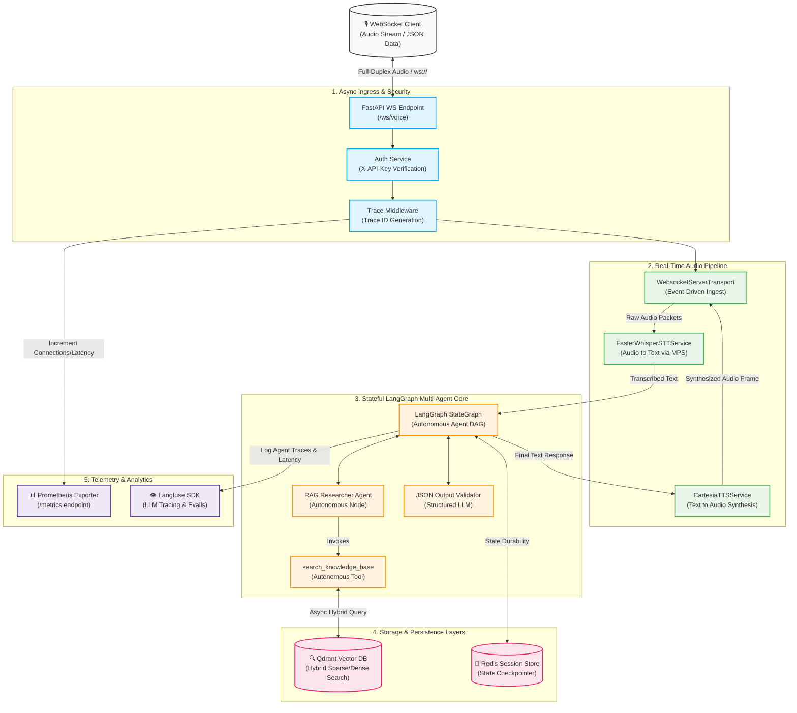

# 🌟 AI Agent Template

A state-of-the-art, **100% offline-first**, multi-agent voice AI architecture optimized for ultra-low latency execution on Apple Silicon (M-Series MPS hardware acceleration) and enterprise high-concurrency environments.

[](https://www.python.org/)
[](https://fastapi.tiangolo.com/)
[](https://github.com/langchain-ai/langgraph)
[](https://qdrant.tech/)
[](https://redis.io/)
[](https://ollama.com/)
[](https://www.docker.com/)

---

## 🎯 Architectural Philosophy & Engineering Highlights

This template is engineered to address the toughest challenges in production Voice AI: **latency, state durability, and network instability**.

* **Sub-100ms Pipeline Reactivity**: Powered by an event-driven **Pipecat** transport layer, bridging raw microphone streams through **Faster-Whisper STT** and structured **Cartesia TTS** with zero idle blocking.
* **Resilient Socket Sessions**: Uses a thread-aware **Redis checkpointer** within LangGraph. If a WebSocket connection drops mid-speech, the session resumes seamlessly upon reconnection without losing agent memory state.
* **Hardware Accelerated & Local**: Orchestrated to leverage Apple Silicon's **MPS (Metal Performance Shaders)** and unified memory architecture, running large LLMs and local embedders completely offline at high token-per-second rates.
* **Enterprise-Grade Observability**: Integrates custom middleware that forces distributed trace propagation (`X-Trace-ID`) across asynchronous thread pools, with live **Prometheus instrumentation** (`/metrics`) and deep agent step-tracing via **Langfuse**.

---

## 🏗️ Core System Architecture

The flowchart below demonstrates the full-duplex data flow, showing how raw audio packets are ingested, parsed into semantic intent, run through an autonomous multi-agent state graph, and synthesized back to the user under a unified telemetry scope.



---

## 🛠️ The 5-Layer Tech Stack

### 1. Ingress Layer (`src/backend/main.py`)

* **Asynchronous Full-Duplex WebSockets**: Utilizes ASGI protocol directly under FastAPI to stream audio back and forth concurrently.
* **API Security Handshake**: Incorporates active API Key verification inside the WebSocket handshake lifecycle.
* **Trace Propagation**: Hooks custom Starlette middleware to generate, carry, and output uniform correlation IDs (`X-Trace-ID`) across isolated asynchronous contexts.

### 2. Orchestration Layer (`src/backend/services/agent_service.py`)

* **Autonomous LangGraph Engine**: Rips out primitive sequential architectures in favor of a dynamic graph schema featuring an autonomous **RAG Researcher** agent that dynamically evaluates when to request local knowledge bases via structured tools.
* **Distributed State Saving**: Implements LangGraph's `MemorySaver` (with `PostgresSaver` and `RedisSaver` blueprints) to make agents fully stateless across distributed horizontal instances.

### 3. Agent & LLM Factory Layer (`src/agents/base/llm_factory.py`)

* **Local LLM Interface**: Implements modern `AsyncChatOllama` utilizing optimized inference runners for Apple Silicon.
* **Fault-Tolerant Retries**: Wraps the network/inference boundary using `tenacity` exponential backoff, ensuring complete resistance against system pauses or local GPU model reloads.

### 4. Vector & Cache Database Layer (`src/backend/services/cache_service.py`)

* **Hybrid Search Pattern**: Employs Qdrant's high-speed client supporting synchronous/asynchronous hybrid lookups. Connects sparse representations (BM25) with dense embeddings to guarantee ultra-high retrieval precision for specialized policies.
* **Stateless Connection Pooling**: Designed with structured collection checkers to assert database readiness at service startup automatically.

### 5. Telemetry & Infrastructure Layer (Docker & Kubernetes)

* **Docker Compose Configuration**: Pre-packaged container specifications deploying your API, a localized GPU-supported Ollama runtime, a persistent Qdrant instance, and a Redis database cluster.
* **Prometheus Metrics Exporter**: Automatically computes real-time request counts, custom endpoint latencies, active socket connection states, and error trends.

---

## 🚀 Getting Started

Ensure you have **macOS (Apple Silicon)**, Docker, and the ultra-fast Rust-based Python package manager **`uv`** installed.

### 1. Project Initialization & Environment Setup

Clone this repository, then create and seed your local configuration:

```bash
cp .env.example .env
```

Open `.env` and fill in your custom configurations.

### 2. Fast Environment Build using `uv`

Leverage `uv` to instantiate virtual environments, lock dependencies, and install systems at blazingly fast speeds:

```bash
# Verify uv installation and install project dependencies
make install
```

### 3. Spin up Local Infrastructure

Build and run the localized infrastructure (FastAPI, Qdrant, Redis, Ollama):

```bash
# Build & run Docker containers
make docker-build
make docker-up
```

### 4. Seed Local Vector Store

Upload your localized text data or corporate policies directly into the Qdrant service:

```bash
# Seed the local Qdrant collection
make seed
```

---

## 📊 Live Metrics & Diagnostics

The platform exports rich real-time diagnostic systems for operations monitoring:

* **Liveness & Readiness Health Endpoint**: Exposed publicly at `/health`. Returns instant uptime and application version details.
* **Prometheus Metrics**: Exposed at `/metrics`. Standardized for Scraping by Grafana/Prometheus collectors to log custom API Latencies, request tracking, and live WS socket connections.
* **Distributed LLM Tracing**: Configurable with **Langfuse** by populating keys in `.env` to record total costs, per-agent latency breakdowns, and detailed evaluation workflows.
