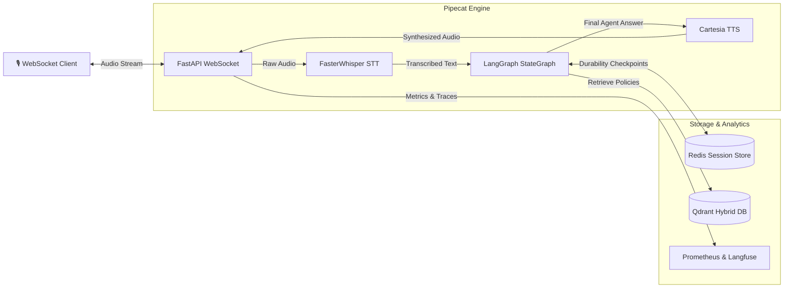

# 🚀 Multi-Agent Voice AI Platform: Enterprise Cookiecutter Template

A production-ready **Cookiecutter template** to scaffold a 100% offline-first, full-duplex, multi-agent voice AI architecture. Optimized for ultra-low latency execution on Apple Silicon (M-series MPS hardware acceleration) and enterprise distributed environments.

This repository serves as an advanced architectural blueprint. Instead of starting from scratch, developers can instantiate a fully connected, enterprise-grade Voice AI platform featuring real-time WebSockets, stateful multi-agent DAGs, and hybrid search vector databases in a single command.

[](https://github.com/cookiecutter/cookiecutter)
[](https://www.python.org/)
[](https://fastapi.tiangolo.com/)
[](https://github.com/langchain-ai/langgraph)
[](https://qdrant.tech/)
[](https://redis.io/)

---

## 🏗️ The Scaffolding Power: Why This Template?

In high-concurrency voice applications, configuring real-time audio streams, handling state across network reconnects, and managing local LLM pipelines takes weeks of boilerplate work. 

This template wraps a professional **5-Layer Technical Stack** that handles:
*   **WebSockets & Custom Ingress Middleware**: Trace ID generation (`X-Trace-ID`) propagated across async context borders for distributed debugging.
*   **Event-Driven Audio Ingestion**: Integrated **Pipecat**, **Faster-Whisper STT** (local hardware-accelerated transcription), and **Cartesia TTS**.
*   **Dynamic Orchestration**: Stateful **LangGraph StateGraph** (autonomous Supervisor, dynamic RAG Researcher agent, and structured JSON Output Validator).
*   **State Durability**: Multi-session thread-safe persistence using memory savers (with scalable Redis/PostgreSQL backend compatibility).
*   **Hybrid Dense/Sparse Vector Search**: Powered by Qdrant to merge neural semantics with traditional keyword matching.

---

## ⚡ Rapid Scaffolding (10-Second Setup)

You can generate your custom, fully-configured multi-agent workspace using standard Python tooling or the ultra-fast Rust-based Python runner `uv`.

### Method A: Using `uv` (Recommended / Instant)
If you have the modern `uv` tool manager installed, execute:
```bash
uv tool run cookiecutter https://github.com/Arif-Badhon/multi_agent_platform_template.git --directory multi_agent_cookiecutter
```

### Method B: Using Standard `pip`
```bash
# 1. Install cookiecutter globally or in a virtual env
pip install cookiecutter

# 2. Run cookiecutter pointing directly to this repository
cookiecutter https://github.com/Arif-Badhon/multi_agent_platform_template.git --directory multi_agent_cookiecutter
```

### Configuration Prompts:
During execution, the CLI will prompt you for configuration parameters, immediately compiling them throughout the source code, configs, Dockerfiles, and compose files:
```text
project_name [Multi Agent Platform]: My Custom Voice Agent
project_slug [my_custom_voice_agent]: my_custom_voice_agent
author_name [Arif]: Your Name
description [Real-time, offline, multi-agent architecture.]: My enterprise agent pipeline
python_version [3.11]: 3.12
```

---

## 📐 Generated Repository Blueprint

Once generated, your project will follow a clean, separation-of-concerns modular layout:

```text
📂 <your-project-slug>/
├── 📄 Dockerfile                 # High-performance multi-stage Docker build
├── 📄 docker-compose.yml         # Local stack: API + Redis + Qdrant + local Ollama GPU runner
├── 📄 Makefile                   # Unified developer entrypoints (make install, make seed, make up)
├── 📄 pyproject.toml             # Modern dependency specs built for uv
├── 📄 .gitignore                 # Pre-configured Python and IDE ignore patterns
├── 📄 .env.example               # Secure, structured environment template
└── 📂 src/
    ├── 📂 agents/
    │   └── 📂 base/
    │       └── 📄 llm_factory.py # Ollama LLM provider factory with tenacity retry limits
    └── 📂 backend/
        ├── 📄 main.py            # FastAPI WebSocket route, STT/TTS pipeline, auth dependency
        ├── 📂 core/
        │   └── 📄 config.py      # Case-insensitive Pydantic Settings management
        └── 📂 services/
            ├── 📄 agent_service.py # Core LangGraph DAG, memory savers, tools
            └── 📄 cache_service.py # Qdrant asynchronous hybrid database client
```

---

## 📊 Visual System Dataflow

The generated project orchestrates a secure, concurrent audio-feedback loop:



---

## 🎓 Recruiter & Staff Engineer Spotlight

If you are reviewing this repository to evaluate architectural competency, here are the core design decisions made:

1.  **Asynchronous Concurrency Model**: The generated server leverages fully non-blocking I/O (`async/await`) across all endpoints and database calls. This keeps the application event loop clear, allowing a single lightweight process to handle hundreds of concurrent WebSocket clients.
2.  **Stateless API with Persistent Graph Checkpointers**: Instead of storing the agent conversation state in API memory (which prevents horizontal scaling), LangGraph uses a distributed key-value store (Redis) to sync session memory. This guarantees high availability and zero-downtime rolling updates.
3.  **Strict Data Isolation and Safety**: Multi-tenant or single-tenant instances can separate corporate documents easily inside the isolated Qdrant index namespaces dynamically injected by Cookiecutter settings.
4.  **Distributed Telemetry Rigor**: System health is actively exposed via health check probes, Prometheus scrapers, and unified correlation tracing IDs, matching patterns used in massive, production Kubernetes microservice meshes.
